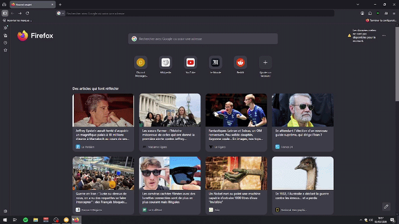

# Discord Searcher 🔍

Discord Searcher is a project to explore and search messages from Discord users across guilds and channels. It consists of a **backend API** (FastAPI + PostgreSQL) and a **simple frontend** (HTML/JS) for testing.



> ⚠️ **Important:** This project is for **educational purposes only**. Use at your own risk. The author assumes **no responsibility** for misuse or violation of Discord's terms of service.

---

## Features

- Retrieve all guilds where a user has sent messages.
- List all channels in a specific guild where a user has been active.
- Fetch messages from a user in a specific channel.
- Minimal frontend to search messages by user ID.

---

## Setup

### 1. Backend Environment

Create a `.env` file in the backend folder with your PostgreSQL credentials and Discord bot token:

```
DB_NAME="discord_scrap"
USER=""
PASSWORD=""
HOST=""
PORT=

DISCORD_BOT_TOKEN="" 
```

> **Note:** The Discord bot token is used to make requests to the Discord API for the searcher. Make sure you have a valid bot and token (**NOT_REQUIRED**).

---

### 2. Discord User Tokens for Scraping

Create a `config.json` file inside `backend/js-scrapper/` containing a list of discord user tokens for scraping:

```json
{
  "tokens": [
    "user_token_1",
    "user_token_2"
  ]
}
```

> ⚠️ Using user tokens can be risky. You are fully responsible for their use. This project is **educational only** and not intended for production or malicious purposes.

---

### 3. Install Dependencies

#### For Python dependencies:

While being inside the main folder, run the following commands:

1. **Create a virtual environment**  
```bash
python -m venv venv
``` 
2. **Activate it**
```bash
source venv/bin/activate    # Linux/Mac
```
3. **Install dependencies**
```bash
pip install -r requirements.txt
```
 
#### For JavaScript dependencies:
 - Go to: `backend/js_scrapper` (for JavaScript scrapping)

 - Run:```npm install```

---

### 4. Running the Project
0. Make sure that you have completed all the previous steps correctly and in order.

1. **Create and initialize the database**  
   Run `db_init.py` located in `backend/db_init/`. 
   > Only needed the **first time** you set up the project, or if you want to **reset/recreate the database tables**.

2. **Start the scrapping process**  
   Run `index.js` located in `backend/js_scrapper/`.

3. **Start ingesting data into the database**  
   Run `main.py` located in `backend/ingest/`.

4. **Start the backend API**  
   Run `run_api.py` located in `backend/api/`.

5. **Start the frontend**  
   Open `frontend/serve_frontend.py`, then open `frontend/index.html` or type `localhost:8080` in a web browser.

<br>

**IMPORTANT:** Each module can be started independently, but they must be run in the correct order for the project to work properly. Make sure to follow the steps carefully. 

---
- This project is **not ready-to-use as-is**. You must configure `.env` and `config.json` properly.
- Using Discord user tokens or bot tokens for scraping is **at your own risk**. Misuse may violate Discord's Terms of Service.
- The author assumes **no responsibility** for any issues caused by this project.
- This project is **intended strictly for educational purposes**.
---

## License

This project is **open-source** for educational purposes. See LICENSE for details.
